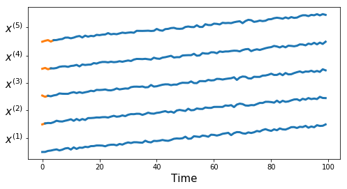
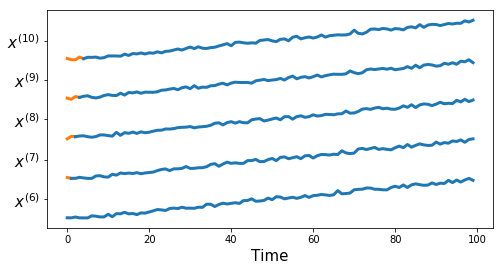
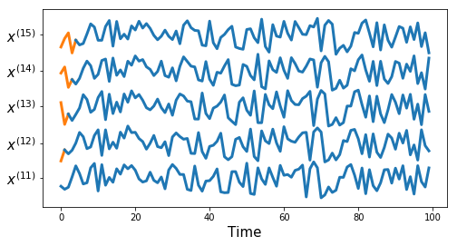
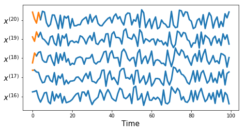
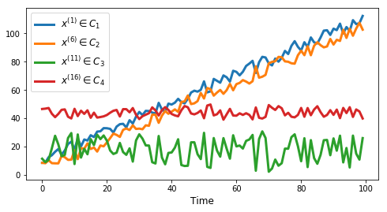
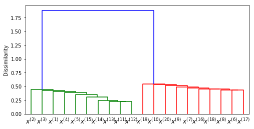
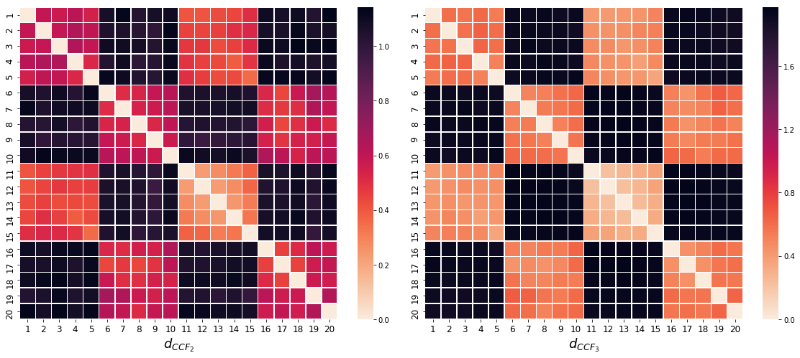
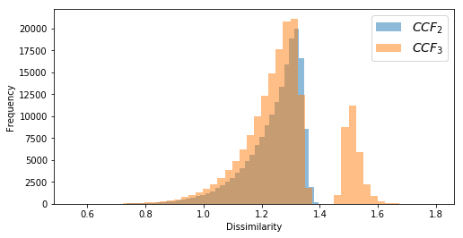
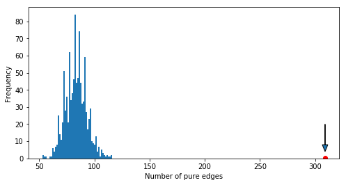

```python
import numpy as np
import pandas as pd
import matplotlib.pyplot as plt


import utils as tu
from hier_clust import *
```

# Synthetic Dataset 1


```python
df, true_cluster = tu.get_synthetic_data('datasets/synthetic_data1.csv')
res_df, true_cluster = tu.get_synthetic_data('results/synthetic_data1_res.csv')
```


```python
plt.rcParams['figure.figsize'] = (8.0, 4.0)
tu.plot_series(df, nr_series_per_class=5)
```














```python
tu.plot_one_per_class(df, nr_series_per_class=5)
```





```python
measures = ['euclidean', 'dtw', 'corr1', 'corr2',
            'cross_corr1', 'cross_corr2', 'cross_corr3',
            'acf', 'pacf', 'rccf1', 'rccf2', 'rccf3']
```


```python
get_sim_index(measures, df, res_df, true_cluster)
```


<div>
<style scoped>
    .dataframe tbody tr th:only-of-type {
        vertical-align: middle;
    }

    .dataframe tbody tr th {
        vertical-align: top;
    }

    .dataframe thead th {
        text-align: right;
    }
</style>
<table border="1" class="dataframe">
  <thead>
    <tr style="text-align: right;">
      <th></th>
      <th>single</th>
      <th>complete</th>
      <th>average</th>
    </tr>
  </thead>
  <tbody>
    <tr>
      <th>euclidean</th>
      <td>0.363636</td>
      <td>0.380952</td>
      <td>0.380952</td>
    </tr>
    <tr>
      <th>dtw</th>
      <td>0.380952</td>
      <td>0.439935</td>
      <td>0.380952</td>
    </tr>
    <tr>
      <th>corr1</th>
      <td>0.334127</td>
      <td>0.243590</td>
      <td>0.294444</td>
    </tr>
    <tr>
      <th>corr2</th>
      <td>0.334127</td>
      <td>0.243590</td>
      <td>0.243590</td>
    </tr>
    <tr>
      <th>cross_corr1</th>
      <td>1.000000</td>
      <td>1.000000</td>
      <td>1.000000</td>
    </tr>
    <tr>
      <th>cross_corr2</th>
      <td>1.000000</td>
      <td>1.000000</td>
      <td>1.000000</td>
    </tr>
    <tr>
      <th>cross_corr3</th>
      <td>1.000000</td>
      <td>1.000000</td>
      <td>1.000000</td>
    </tr>
    <tr>
      <th>acf</th>
      <td>0.321429</td>
      <td>0.321429</td>
      <td>0.321429</td>
    </tr>
    <tr>
      <th>pacf</th>
      <td>0.363636</td>
      <td>0.363636</td>
      <td>0.363636</td>
    </tr>
    <tr>
      <th>rccf1</th>
      <td>1.000000</td>
      <td>1.000000</td>
      <td>1.000000</td>
    </tr>
    <tr>
      <th>rccf2</th>
      <td>1.000000</td>
      <td>1.000000</td>
      <td>1.000000</td>
    </tr>
    <tr>
      <th>rccf3</th>
      <td>0.722222</td>
      <td>0.949495</td>
      <td>0.949495</td>
    </tr>
  </tbody>
</table>
</div>


```python
chosen_measures = ['cross_corr2', 'cross_corr3',
                   'rccf2', 'rccf3']
cluster_numbers = list(range(2,11))
```


```python
get_sil_index(chosen_measures, cluster_numbers, df, res_df)
```


<div>
<style scoped>
    .dataframe tbody tr th:only-of-type {
        vertical-align: middle;
    }

    .dataframe tbody tr th {
        vertical-align: top;
    }

    .dataframe thead th {
        text-align: right;
    }
</style>
<table border="1" class="dataframe">
  <thead>
    <tr style="text-align: right;">
      <th></th>
      <th>cross_corr2</th>
      <th>cross_corr3</th>
      <th>rccf2</th>
      <th>rccf3</th>
    </tr>
  </thead>
  <tbody>
    <tr>
      <th>2</th>
      <td>0.530485</td>
      <td>0.739282</td>
      <td>0.530762</td>
      <td>0.692445</td>
    </tr>
    <tr>
      <th>3</th>
      <td>0.329060</td>
      <td>0.426181</td>
      <td>0.401696</td>
      <td>0.477057</td>
    </tr>
    <tr>
      <th>4</th>
      <td>0.323237</td>
      <td>0.420283</td>
      <td>0.288671</td>
      <td>0.288671</td>
    </tr>
    <tr>
      <th>5</th>
      <td>0.316615</td>
      <td>0.413631</td>
      <td>0.270898</td>
      <td>0.270898</td>
    </tr>
    <tr>
      <th>6</th>
      <td>0.298892</td>
      <td>0.404116</td>
      <td>0.228582</td>
      <td>0.228582</td>
    </tr>
    <tr>
      <th>7</th>
      <td>0.279041</td>
      <td>0.384262</td>
      <td>0.229174</td>
      <td>0.229174</td>
    </tr>
    <tr>
      <th>8</th>
      <td>0.279625</td>
      <td>0.384827</td>
      <td>0.225471</td>
      <td>0.225471</td>
    </tr>
    <tr>
      <th>9</th>
      <td>0.282080</td>
      <td>0.387268</td>
      <td>0.184505</td>
      <td>0.184505</td>
    </tr>
    <tr>
      <th>10</th>
      <td>0.095913</td>
      <td>0.095913</td>
      <td>0.186782</td>
      <td>0.186782</td>
    </tr>
  </tbody>
</table>
</div>


```python
clustering = HClust(df, true_cluster, 'cross_corr3')
clustering.plot_dendrogram()
```





```python
clustering1 = HClust(df, true_cluster, 'cross_corr2')
clustering2 = HClust(df, true_cluster, 'cross_corr3')

fig = plt.figure(figsize=(20, 8))
fig.subplots_adjust(hspace=0.4, wspace=0.02)

fig.add_subplot(1, 2, 1)
clustering1.plot_heatmap(xlab='$d_{CCF_2}$')

fig.add_subplot(1, 2, 2)
clustering2.plot_heatmap(xlab='$d_{CCF_3}$')
```





# Clustering Stock Prices


```python
clustering = HClust(data=stock_data, ground_truth=None,
                     dist_func='cross_corr3', verbose=True)
clustering.dist_mat.to_csv('results/diss_mat_ccf3.csv', index=None, header=None)
```

    Dissimilarity computation: 100% [-------------------------------] Time: 0:32:53
    


```python
diss_mat_ccf2 = pd.read_csv('results/diss_mat_ccf2.csv', header=None, index_col=None)
diss_mat_ccf3 = pd.read_csv('results/diss_mat_ccf3.csv', header=None, index_col=None)
```


```python
diss_ccf2 = np.triu(diss_mat_ccf2.values,1).flatten()
diss_ccf3 = np.triu(diss_mat_ccf3.values,1).flatten()
plt.hist(diss_ccf2[diss_ccf2!=0], bins=50, alpha=0.5, label='${CCF_2}$')
plt.hist(diss_ccf3[diss_ccf3!=0], bins=50, alpha=0.5, label='${CCF_3}$')
plt.xlabel('Dissimilarity')
plt.ylabel('Frequency')
plt.legend(fontsize=14);
```





```python
sectors = pd.read_csv('datasets/sectors.csv', header=None)
```


```python
from sklearn.preprocessing import LabelEncoder
sectors_numeric = LabelEncoder().fit_transform(sectors)
```


```python
get_similarities(diss_mat_ccf2, ground_truth=sectors_numeric)
```


<div>
<style scoped>
    .dataframe tbody tr th:only-of-type {
        vertical-align: middle;
    }

    .dataframe tbody tr th {
        vertical-align: top;
    }

    .dataframe thead th {
        text-align: right;
    }
</style>
<table border="1" class="dataframe">
  <thead>
    <tr style="text-align: right;">
      <th></th>
      <th>single</th>
      <th>complete</th>
      <th>average</th>
    </tr>
  </thead>
  <tbody>
    <tr>
      <th></th>
      <td>0.087304</td>
      <td>0.325193</td>
      <td>0.145864</td>
    </tr>
  </tbody>
</table>
</div>


```python
permutations = pd.read_csv('results/null_distribution1.csv')
```


```python
permutations.plot(kind='hist', bins=50, legend=False)
s0 = 309
plt.plot(s0, 0.5, 'ro')
plt.arrow(s0, 20, 0, -16, length_includes_head=True,
          head_width=5, head_length=4)
plt.xlabel('Number of pure edges');
```




